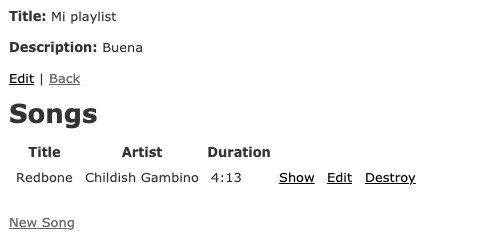

# Ayudantía 3: Rails routing + views

Vamos a hacer una guía paso a paso de lo que vimos en la ayudantía 3. Primero, partimos con dos entidades creadas con `scaffold`: `Playlists` y `Songs`. Para esto utilizamos los siguientes comandos:
```bash
docker-compose run web rails generate scaffold Playlist name:string description:string
```
```bash
docker-compose run web rails generate scaffold Song name:string artist:string duration:string
```

Para efectos de este ejemplo, no nos interesa realmente el tipo de dato de los atributos, los simplificamos todos como string. Como bien saben, `scaffold` es muy :sparkles: *mágico* :sparkles: y nos crea todos los recursos que necesitamos para trabajar con dichas entidades: el **modelo** en la base de datos, el **controlador** con funciones básicas para `index`, `show`, `new`, `create`, `update`y `destroy` y por supuesto las **views** necesarias para los CRUD: `new` y `edit` con su `form` y también `index` y `show`. Sin embargo, lo necesario para poder empezar a jugar con esto desde el lado del cliente es: las **migraciones** y las **rutas**. Lo primero, es porque cada vez que hagamos algo que vaya a generar cambios en la base de datos debemos efectivamente aplicarlos en ella, y esto se hace a través del comando:
```bash
docker-compose run web rails db:migrate
```
Ahora lo que nos interesa: las rutas. Y más específicamente cómo anidarlas tanto a ellas como a los recursos. Aquí vamos a ir paso por paso.

## 1. Asociaciones en el modelo
Siguiendo con el ejemplo de la ayudantía, queremos que nuestras `Playlists` tengan `Songs`, por lo que primero **hacemos las asociaciones en el modelo:**
```ruby
# /app/models/playlist.rb
class Playlist < ApplicationRecord
  has_many :songs, :dependent => :destroy
end
```
```ruby
# /app/models/song.rb
class Song < ApplicationRecord
  belongs_to :playlist
end
```
Ahora, gracias a la magia de [Active Record]([https://guides.rubyonrails.org/active_record_basics.html](https://guides.rubyonrails.org/active_record_basics.html)) podemos usar funciones como `@playlist.songs`, siendo `@playlist` una variable donde guardamos la instancia de una lista de reproducción.
## 2. Asociaciones en las rutas
Luego, debemos preocuparnos de las *routes*. Para ver las rutas que tienen disponibles actualmente, tienen que tener **corriendo** la aplicación (es decir, tener su imagen: `docker-compose up`) y pueden hacerlo de dos formas:

- Entrar a `localhost:3000/rails/info/routes`
- Correr `docker-compose run web rake routes` - en otra tab o terminal. Esto último es gracias a una gema que viene por default en su app: `rake`. *De aquí en adelante en este tutorial ocuparemos `docker-compose run web` como el alias `dcrun`. Si quieren hacerlo ustedes pueden ver un tutorial [acá](https://wpshout.com/quick-guides/make-bash-alias/) para bash*.

Con esto, van a poder ver algo de esta forma (está acortado):
```bash
Starting torpedo_postgres_1 ... done

Prefix Verb URI Pattern  Controller#Action

playlist_songs GET  /playlists/:playlist_id/songs(.:format)  songs#index

POST /playlists/:playlist_id/songs(.:format)  songs#create

new_playlist_song GET  /playlists/:playlist_id/songs/new(.:format)  songs#new

edit_playlist_song GET  /playlists/:playlist_id/songs/:id/edit(.:format) songs#edit

playlist_song GET  /playlists/:playlist_id/songs/:id(.:format)  songs#show
```
La idea es que podamos crear canciones **dentro** de playlists, por lo que buscamos que en vez de tener rutas separadas como `/playlists/` -que sería el index de todas las playlists disponibles-, y `/songs/` que serían todas las canciones disponibles, tener algo como `playlists/1/songs`, que serían todas las canciones creadas en la playlist con id 1. Pero si se fijan, en las rutas actuales no existe algo como eso. Es por esto que ahora debemos **hacer las asociaciones en las rutas**:

```ruby
# config/routes.rb
Rails.application.routes.draw do
  resources :playlists do
    resources :songs
  end
  root to: 'home#home'
  # la sentencia 'root to' es para setear
  # dónde llega localhost:3000
end
```

Con esto, si corremos nuevamente nuestro comando `dcrun rake routes` tendrán algo como esto:

```bash
Starting torpedo_postgres_1 ... done

Prefix Verb URI Pattern  Controller#Action

playlist_songs GET  /playlists/:playlist_id/songs(.:format)  songs#index

POST /playlists/:playlist_id/songs(.:format)  songs#create

new_playlist_song GET  /playlists/:playlist_id/songs/new(.:format)  songs#new

edit_playlist_song GET  /playlists/:playlist_id/songs/:id/edit(.:format) songs#edit

playlist_song GET  /playlists/:playlist_id/songs/:id(.:format)  songs#show

PATCH  /playlists/:playlist_id/songs/:id(.:format)  songs#update

PUT  /playlists/:playlist_id/songs/:id(.:format)  songs#update

DELETE /playlists/:playlist_id/songs/:id(.:format)  songs#destroy

playlists GET  /playlists(.:format) playlists#index

POST /playlists(.:format) playlists#create

new_playlist GET  /playlists/new(.:format) playlists#new

edit_playlist GET  /playlists/:id/edit(.:format)  playlists#edit

playlist GET  /playlists/:id(.:format) playlists#show

PATCH  /playlists/:id(.:format) playlists#update

PUT  /playlists/:id(.:format) playlists#update

DELETE /playlists/:id(.:format) playlists#destroy

root GET  /  home#home
```

Vieron el cambio? Con esto, vamos a olvidarnos de las canciones por sí solas. Si se dan cuenta ya no existe la ruta para ellas. Ahora tenemos rutas nuevas como por ejemplo `new_playlist_song`, que como se pueden fijar en la columna siguiente recibe el parámetro `playlist_id` y se puede acceder desde `localhost:3000/playlists/<playlist_id>/songs/new`. Esto creará una canción nueva dentro de la playlist, agregándole su id a su columna `playlist_id`.

Ojo: Si queremos tener las canciones por sí solas también, deberíamos agregarlas de esta forma al archivo `routes`:

```ruby
	# config/routes.rb
	Rails.application.routes.draw do
	  resources :playlists do
	    resources :songs
	  end
	  resources :songs
	  root to: 'home#home'
	  # la sentencia 'root to' es para setear
	  # dónde llega localhost:3000
	end
```

### Disclaimer
Antes de seguir, un disclaimer: si al crear nuestras entidades con `scaffold` no agregamos previamente nuestra foreign key, debemos hacerlo ahora con una migración:

```bash
dcrun rails generate migration AddPlaylistIdToSongs
```

Con esto se creará un archivo en el path `db/migrate`, y acá agregarán cualquier acción para editar la base de datos, en nuestro caso:

```ruby
# db/migrate/<numero>_add_playlist_id_to_songs.rb
class AddPlaylistIdToSongs < ActiveRecord::Migration[5.1]
  def change
    add_column :songs, :playlist_id, :integer
  end
end
```

Acá le estamos diciendo: agrégale una columna a `songs` que se llame `playlist_id` y sea de tipo integer.

Luego de **cualquier cambio a la base de datos**, tenemos que migrarla por supuesto:

```bash
dcrun rails db:migrate
```

## 3. Editar el controlador y nuestras views
Ahora viene la parte más tediosa. Por ahora nuestros `scaffold` nos crearon *views* y funciones en nuestros controladores para prácticamente todo, sin embargo no nos son totalmente útiles por tres cosas:

1. Probablemente queremos tener algo como esto cuando entremos a una playlist específica (`localhost:3000/playlists/1`):

2. El form que tenemos actualmente para crear canciones no utiliza el nuevo path que creamos.

4. El controlador para `create` no tiene idea tampoco que algo cambió.

Para el primer caso, es simple, tenemos que editar la vista y pueden elegir en un principio hacer un link simple desde `playlists/1/` a `playlists/1/songs/` o renderear las canciones en la misma `playlists/1/`. Acá un ejemplo de esto último:

```html
<!-- /app/views/playlists/show.html.erb -->
<p id="notice"><%= notice %></p>

<p>
  <strong>Title:</strong>
  <%= @playlist.title %>
</p>

<p>
  <strong>Description:</strong>
  <%= @playlist.description %>
</p>

<%= link_to 'Edit', edit_playlist_path(@playlist) %> |
<%= link_to 'Back', playlists_path %>

<h1>Songs</h1>

<table>
  <thead>
    <tr>
      <th>Title</th>
      <th>Artist</th>
      <th>Duration</th>
      <th colspan="3"></th>
    </tr>
  </thead>

  <tbody>
    <% @playlist.songs.each do |song| %>
    <!–– Se fijan que acá usamos nuestra nuevo atributo songs? -->
      <tr>
        <td><%= song.title %></td>
        <td><%= song.artist %></td>
        <td><%= song.duration %></td>
        <td><%= link_to 'Show', playlist_song_path(@playlist, song) %></td>
        <td><%= link_to 'Edit', edit_playlist_song_path(@playlist, song) %></td>
        <td><%= link_to 'Destroy', playlist_song_path(@playlist, song), method: :delete, data: { confirm: 'Are you sure?' } %></td>
      </tr>
    <% end %>
  </tbody>
</table>

<br>

<%= link_to 'New Song', new_playlist_song_path(@playlist) %>
```
*Ojo que acá usamos la variable @songs y no le hemos dicho al controlador de `playlists` que eso existe, con lo que sigue en el tutorial (y con la práctica que llevan) deberían poder descubrir cómo hacerlo* :smiling_imp:

 Acá hicimos uso de nuestras nuevas rutas y los parámetros que recibe cada una de ellas, tanto para crear, mostrar, editar y eliminar nuestras canciones. Sin embargo, el controlador de nuestras canciones no tiene idea lo que es `@playlist`, por lo que haremos un método privado que seteará esta variable **antes** de ejecutar cualquiera de estas acciones.

```ruby
# /app/controllers/songs_controller.rb
class SongsController < ApplicationController
  before_action :set_song, only: [:show, :edit, :update, :destroy]
  before_action :set_playlist, only: [:new, :update, :create, :destroy, :show]

# Acá hay mucho código que me salté

  private
    # Use callbacks to share common setup or constraints between actions.
    def set_song
      @song = Song.find(params[:id])
    end

    def set_playlist
      @playlist = Playlist.find(params[:playlist_id])
    end

    # Acá también va código que me salté.
```

Ven lo que hicimos? Le dijimos al controlador que antes de realizar las acciones `:new, :update, :create, :destroy, :show`, tiene que ejecutar `set_playlist`. Esta función busca en el modelo `Playlist` el parámetro de nuestros HTTP headers llamado `playlist_id`. Con esto, vamos a poder utilizar esa variable `@playlist` en cada una de nuestras acciones.

Ahora, tenemos que decirle también cuál es el `playlist_id` de la canción que estamos creando en la función `create` de nuestro controlador de canciones:

```ruby
def create
    @song = Song.new(song_params)
    @song.playlist_id = @playlist.id
    respond_to do |format|
      if @song.save
        format.html { redirect_to playlist_path(@playlist.id), notice: 'Song was successfully created.'}
      else
        format.html { render :new }
        format.json { render json: @song.errors, status: :unprocessable_entity }
      end
    end
  end
```
*(Hay que hacer lo mismo con el edit, les dejamos esa tarea a ustedes)*

Y finalmente, tenemos que decirle también al formulario que ahora estamos enviando los parámetros ingresados por el cliente a otra ruta:

```html
# app/views/songs/_form.html.erb
<%= form_with(model: @song, url: playlist_songs_path, local: true) do |form| %>
  <% if song.errors.any? %>
    <div id="error_explanation">
      <h2><%= pluralize(song.errors.count, "error") %> prohibited this song from being saved:</h2>

      <ul>
      <% song.errors.full_messages.each do |message| %>
        <li><%= message %></li>
      <% end %>
      </ul>
    </div>
  <% end %>

  <div class="field">
    <%= form.label :title %>
    <%= form.text_field :title, id: :song_title %>
  </div>

  <div class="field">
    <%= form.label :artist %>
    <%= form.text_field :artist, id: :song_artist %>
  </div>

  <div class="field">
    <%= form.label :duration %>
    <%= form.text_field :duration, id: :song_duration %>
  </div>

  <div class="actions">
    <%= form.submit %>
  </div>
<% end %>
```

Y *voilà!* Ya podemos crear canciones dentro de nuestras playlists. Esperamos que les sea útil en su proyecto - recuerden que Rails tiene muchísima documentación en internet y existen montones de tutoriales útiles. Véanlos, vean como crear una app desde cero, les va a servir.

Suerte!

# Devise

A continuación, les dejamos algunos links a tutoriales y documentación sobre la gema **Devise**. Como no pudimos verla en la ayudantía, les dejamos esto para que lo investiguen por su cuenta :blush:

* https://www.youtube.com/watch?v=zJYuLebl-Js
* https://code.tutsplus.com/es/tutorials/exploring-devise-part-1--cms-26587
* https://medium.com/@mchisti/creating-simple-users-in-rails-with-devise-gem-tutorial-cd91d2ef36d5
